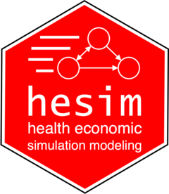

<!-- Navigation Menu -->
<nav style="background-color: #333; padding: 15px 0;">
  <ul style="list-style-type: none; margin: 0; padding: 0; text-align: center;">
    <li style="display: inline; margin: 0 30px;">
      <a href="#home" style="color: white; text-decoration: none; font-size: 18px;">Home</a>
    </li>
    <li style="display: inline; margin: 0 30px;">
      <a href="#about" style="color: white; text-decoration: none; font-size: 18px;">About</a>
    </li>
    <li style="display: inline; margin: 0 30px;">
      <a href="#contact" style="color: white; text-decoration: none; font-size: 18px;">Contact</a>
    </li>
  </ul>
</nav>

<head>
  <title> </title>
</head>

  <!-- Full-width banner image -->
  

  <!-- Title positioned over the banner -->
  <h1 style="
      position: absolute;
      top: 50%;
      left: 50%;
      transform: translate(-50%, -50%);
      font-size: 3em;
      margin: 0;
      padding: 0;
    ">
    Health Economics R Packages
  </h1>

#### BCEA: Bayesian Cost Effectiveness Analysis

[*BCEA*](https://cran.r-project.org/web/packages/BCEA/index.html)
Produces an economic evaluation of a Bayesian model in the form of MCMC simulations. Given suitable variables of cost and effectiveness / utility for two or more interventions, This package computes the most cost-effective alternative and produces graphical summaries and probabilistic sensitivity analysis.  

<button style="margin-top: 10px; background-color: #4CAF50; color: white; padding: 5px 10px; border: none; border-radius: 5px;">Available</button>

  

#### hesim

[*hesim*](https://cran.r-project.org/web/packages/BCEA/index.html) is a modular and computationally efficient R package for health economic simulation modeling and decision analysis that provides a general framework for integrating statistical analyses with economic evaluation.

<button style="margin-top: 10px; background-color: #4CAF50; color: white; padding: 5px 10px; border: none; border-radius: 5px;">Available</button>

  

#### radiant

[*radiant*](https://github.com/radiant-rstats) is an open-source platform-independent browser-based interface for business analytics in R. The application is based on the Shiny package and can be run locally or on a server.

<button style="margin-top: 10px; background-color: orange; color: white; padding: 5px 10px; border: none; border-radius: 5px;">Under Development</button>

  

<button style="margin-top: 10px; background-color: #aaa; color: white; padding: 5px 10px; border: none; border-radius: 5px;">Not Available</button>
