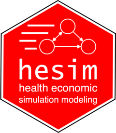

## Health economics packages

   
 
 
 

#### BCEA: Bayesian Cost Effectiveness Analysis

[BCEA](https://cran.r-project.org/web/packages/BCEA/index.html)
Produces an economic evaluation of a Bayesian model in the form of MCMC simulations. Given suitable variables of cost and effectiveness / utility for two or more interventions, This package computes the most cost-effective alternative and produces graphical summaries and probabilistic sensitivity analysis.  

 
 
 
 
 
 
  
#### hesim

[hesim](https://cran.r-project.org/web/packages/BCEA/index.html) is a modular and computationally efficient R package for health economic simulation modeling and decision analysis that provides a general framework for integrating statistical analyses with economic evaluation.

 
 
 
 
 
 
 
  
#### radiant

[radiant](https://github.com/radiant-rstats) is an open-source platform-independent browser-based interface for business analytics in R. The application is based on the Shiny package and can be run locally or on a server.

