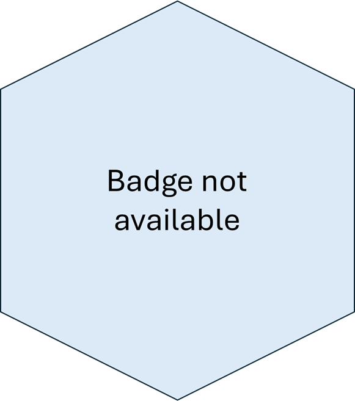

  <!-- Full-width banner image -->
  

  <!-- Title positioned over the banner -->
  <h1 style="
      position: absolute;
      top: 50%;
      left: 50%;
      transform: translate(-50%, -50%);
      font-size: 3em;
      margin: 0;
      padding: 0;
    ">
    Health Economics R Packages
  </h1>

#### BCEA: Bayesian Cost Effectiveness Analysis

[*BCEA*](https://cran.r-project.org/web/packages/BCEA/index.html)
Produces an economic evaluation of a Bayesian model in the form of MCMC simulations. Given suitable variables of cost and effectiveness / utility for two or more interventions, This package computes the most cost-effective alternative and produces graphical summaries and probabilistic sensitivity analysis.  

<button style="margin-top: 10px; background-color: #4CAF50; color: white; padding: 5px 10px; border: none; border-radius: 5px;">Available</button>

    

#### hesim

[*hesim*](https://cran.r-project.org/web/packages/BCEA/index.html) is a modular and computationally efficient R package for health economic simulation modeling and decision analysis that provides a general framework for integrating statistical analyses with economic evaluation.

<button style="margin-top: 10px; background-color: #4CAF50; color: white; padding: 5px 10px; border: none; border-radius: 5px;">Available</button>

     

#### radiant

[*radiant*](https://github.com/radiant-rstats) is an open-source platform-independent browser-based interface for business analytics in R. The application is based on the Shiny package and can be run locally or on a server.

<button style="margin-top: 10px; background-color: orange; color: white; padding: 5px 10px; border: none; border-radius: 5px;">Under Development</button>

     

<button style="margin-top: 10px; background-color: #aaa; color: white; padding: 5px 10px; border: none; border-radius: 5px;">Not Available</button>
